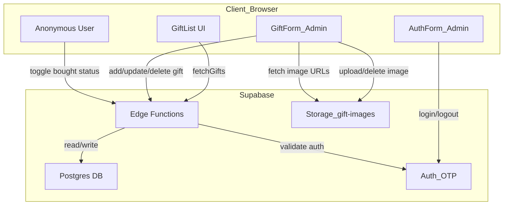
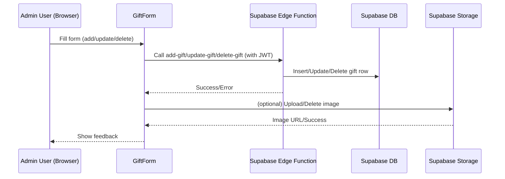
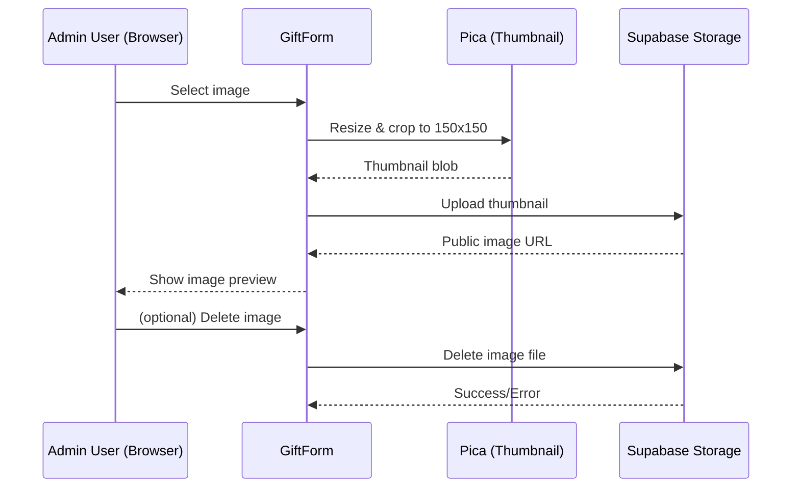
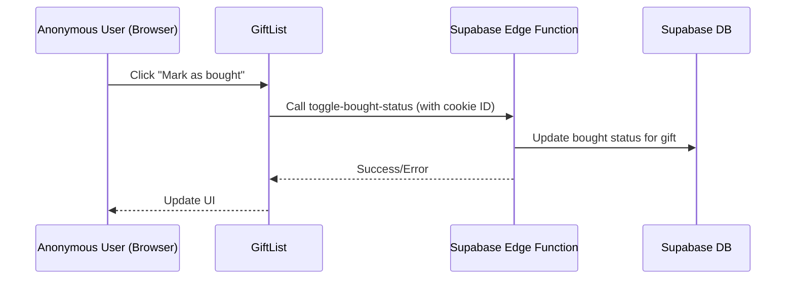
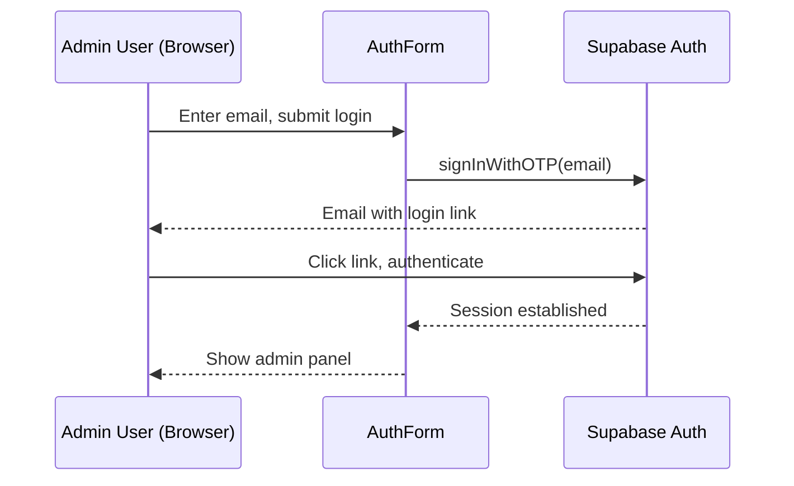

# Architecture

## Overview

BuyMyLove GiftList is a single-page web application for managing and sharing gift ideas. It supports anonymous users (for marking gifts as bought) and admin users (for managing the gift list) via OTP email login. The backend is powered by node.js and a PostgreSQL database and local storage (S3 compatible).

---

## System Diagram

---

## Primary Flows

### 1. Add/Update/Delete Gift (Admin)

---

### 2. Image Handling

---

### 3. Anonymous User: Toggle Bought Status

---

### 4. Admin Login Flow (OTP)

---

## Key Components

- **GiftList**: Displays all gifts, allows anonymous users to mark as bought.
- **GiftForm**: Admin-only, for adding/updating/deleting gifts and images.
- **AuthForm**: Handles admin OTP login/logout.
- **Backend Edge Functions**: Secure backend logic for all gift actions.
- **Backend Storage**: Stores and serves gift images.
- **Backend Auth**: Handles admin authentication via OTP.

---

## Data Flow

- All data operations (add/update/delete/toggle) are routed through backend functions for security.
- Images are processed client-side (cropped/resized) before upload.
- Anonymous users are tracked via a cookie-based ID, sent as a header for bought status toggling.
- Admin status is determined by a valid JWT session.

---

## Security

- Only authenticated admins can add/update/delete gifts.
- Anonymous users can only toggle bought status (no personal data stored).
- All API calls are authenticated via JWT or anonymous key as appropriate.
- No sensitive data is stored in the browser or transmitted unnecessarily.
